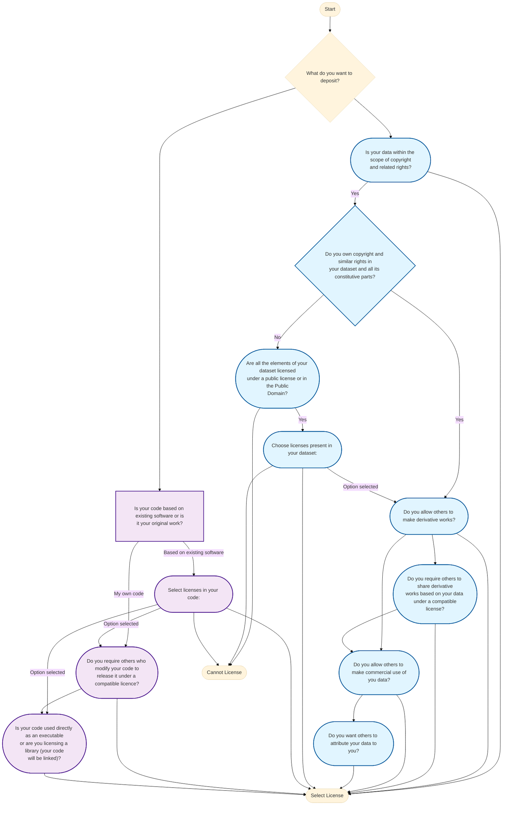
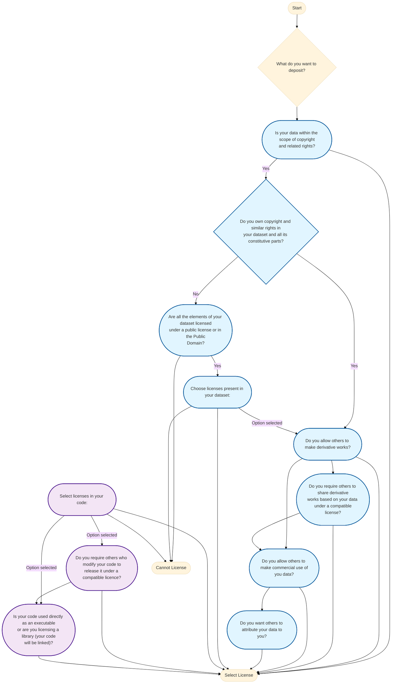
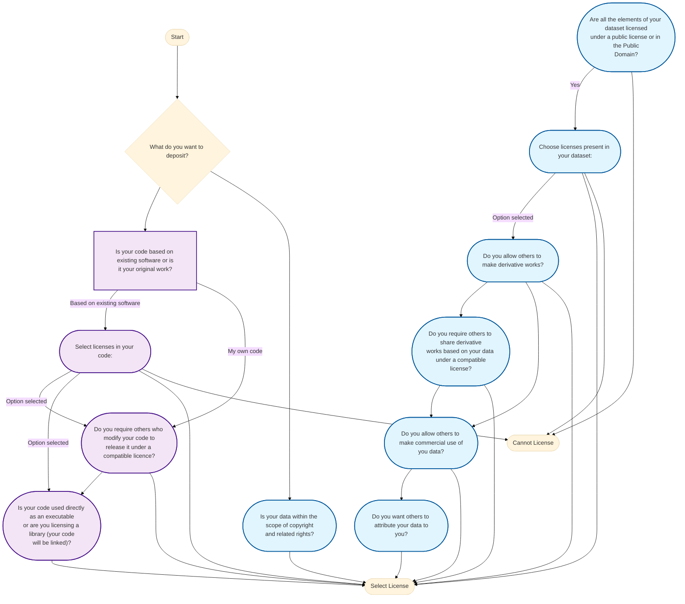

# License Selector State Graph

> **Auto-generated documentation** - Run `npm run generate-graph` to update

## Overview

This document visualizes the decision tree used by the Public License Selector. The selector guides users through a series of questions to recommend appropriate licenses for their software or data.

## Complete State Graph

## Data Licensing Path

## Software Licensing Path

## State Reference Table

| State | Question | Transitions | Type |
|-------|----------|-------------|------|
| KindOfContent | What do you want to deposit? | → YourSoftware → DataCopyrightable | Question |
| DataCopyrightable | Is your data within the scope of copyright and related rights? | → OwnIPR | ✅ Terminal |
| OwnIPR | Do you own copyright and similar rights in your dataset and all its constitutive parts? | → AllowDerivativeWorks → EnsureLicensing | Question |
| AllowDerivativeWorks | Do you allow others to make derivative works? | → ShareAlike → CommercialUse | ✅ Terminal (Conditional) |
| ShareAlike | Do you require others to share derivative works based on your data under a compatible license? | → CommercialUse → CommercialUse | ✅ Terminal (Conditional) |
| CommercialUse | Do you allow others to make commercial use of you data? | → DecideAttribute | ✅ Terminal (Conditional) |
| DecideAttribute | Do you want others to attribute your data to you? | N/A | ✅ Terminal |
| EnsureLicensing | Are all the elements of your dataset licensed under a public license or in the Public Domain? | → LicenseInteropData | ❌ Error |
| LicenseInteropData | Choose licenses present in your dataset: | → AllowDerivativeWorks → AllowDerivativeWorks → AllowDerivativeWorks | ❌ Error |
| YourSoftware | Is your code based on existing software or is it your original work? | → LicenseInteropSoftware → Copyleft | Question |
| LicenseInteropSoftware | Select licenses in your code: | → Copyleft → StrongCopyleft | ❌ Error (Conditional) |
| Copyleft | Do you require others who modify your code to release it under a compatible licence? | → StrongCopyleft | ✅ Terminal (Conditional) |
| StrongCopyleft | Is your code used directly as an executable or are you licensing a library (your code will be linked)? | N/A | ✅ Terminal |

## Legend

- 🔹 **Blue nodes**: Data licensing path
- 🔸 **Purple nodes**: Software licensing path
- ✅ **Green nodes**: Terminal states (license selection)
- ❌ **Red nodes**: Error states (cannot license)
- ♦️ **Diamond shapes**: Yes/No decisions
- ⬜ **Rectangles**: Multi-option questions

## How to Update

1. Modify `src/data/questions.coffee`
2. Run `npm run generate-graph`
3. Review the updated diagrams in this file
4. Commit changes to version control

## Related Files

- **Question Definitions**: `src/data/questions.coffee`
- **License Data**: `src/data/licenses.coffee`
- **Compatibility Matrix**: `src/data/compatibility.coffee`
- **Generator Script**: `scripts/generate-state-graph.js`
